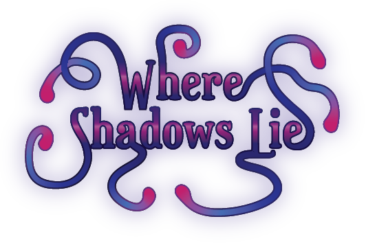

### Developed by Nifty Gibbon 
Team members:  
Navras Kamal - Programmer, Lead Designer  
Johnas Wong - Programmer  
Jordon Ogonoski - Programmer, Sound Implementation  
Cody Balderston - Music Composition & Sound  
Rafaella Graña - Art  
Joel Goodson - Writing, Level Design  

[Web Tech Demo](/Where-Shadows-Lie-TechDemo/index.html)  

[Web VS2](/Where-Shadows-Lie-VS2/index.html)  

[Web Beta](/Where-Shadows-Lie-Beta/index.html)  
  
[Web Gold](/Where-Shadows-Lie-Gold/index.html)

[Web Gold 2](/Where-Shadows-Lie-Gold-2/index.html)

[Web Gold 3](/Where-Shadows-Lie-Gold-3/index.html)

[Web Gold 4](/Gold4/index.html)

[Web Gold 5](/Gold5/index.html)

[Download Gold version for Windows, Linux, and Mac](https://drive.google.com/drive/folders/17Oth8vUswKhUiqdaWF_71yEVlUKgTN4k?usp=sharing)

[Beta Survey](https://docs.google.com/forms/d/e/1FAIpQLSekGYjYwfw56Igb0LpmNZ1XYzRhB4KtqJw63D2Yx3Yzf9Hwfg/viewform?usp=sf_link) for feedback.

Controls:

* WASD - Player Movement
* Right Mouse Click/Escape - Pause.
* Number 1 - Toggle Bomb
* Number 2 - Toggle Dash
* E - Interact
* Q - Skip turn

Mechanics:

* The world is frozen for the duration of each turn
* Moving or waiting out the timer will set the world forward one turn
* Walk into enemies to damage them
* The bomb will damage anything within it's blast radius
* Dash over gaps, or over enemies to damage them
